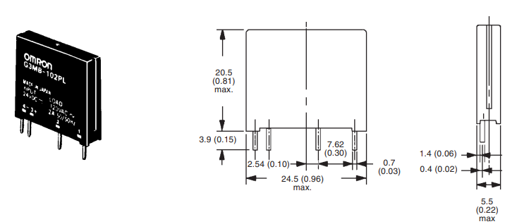
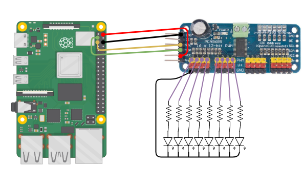
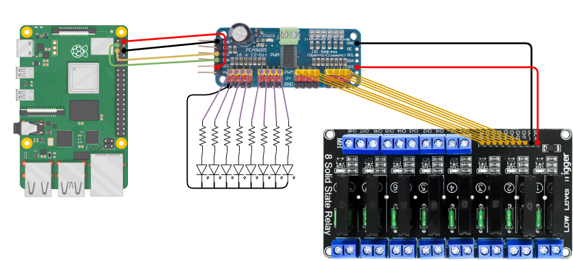

# Raspberry PI + PCA9685 + 8 Solid State Relay

Test de commande du module de 8 relais à Semi-conducteurs, depuis la Raspberry PI et via le PCA9685

## Module 8 Solid State Relay

<a></a>

- SSR Output (each channel):
    - Load voltage range: 75 to 264VAC (50/60Hz).
    - Load current: 0.1 to 2 AMP.
- Power supply:
    - 5VDC / 160mA (all channel ON).
- Input control signal voltage:
    - 0V - 0.5V Low stage (SSR is OFF)
    - 0.5V ¨C 2.5V (unknown state).
    - 2.5V - 20V High state (SSR is ON).
- SSR Spec.:
    - Manufacturer: OMRON
    - Part number: G3MB-202P, 5V version.
    - Isolation: Phototriac.
    - Zero cross: Yes.
    - Rated output load: 2A at 100 to 240VAC.(50/60Hz).
    - Load type: General purpose.

#### Atttention !!!

les modules "Solid State Relay" sont proposés sous 2 variants : en logique de commande "haute" ou en logique de commande "basse" :

- Module à logique haute :
  - 0-2.5V en entrée  --> relais activé
  - 3.3-5V en entrée  --> relais désactivé
- Module à logique basse :
  - 0-2.5V en entrée  --> relais désactivé
  - 3.3-5V en entrée  --> relais activé

(voir description : https://fr.aliexpress.com/item/1005001621690700.html)


#### Le module est donc composé de 8 relais type "Solid State" modèle G3MB-202P

| <a></a>|<a></a>|
|-----|-----|

---

## Module PCA9685

<a></a>

Le module PCA9685 est un contrôleur 16 canaux qui permet de piloter 16 sorties PWM via la communication I2C.
Il permet entre autre de libérer des entrées sorties du microcontrôleur (Arduino, Esp8266, ... ) ou de la Raspberry PI.
Il permetde piloter jusqu’à 16 LED, ou servomoteurs, ou relais

*Docs techniques :*

- https://www.adafruit.com/product/815
- https://learn.adafruit.com/16-channel-pwm-servo-driver/downloads
- https://learn.adafruit.com/16-channel-pwm-servo-driver/chaining-drivers

### Exemple de raccordement (avec 8 LEDs)

| RPI Pin out</br><a href="RPI/GPIO-Pinout-Diagram-2.png"></a> |<a href="Schema/RPI_PCA9685_8LED.png"></a> |
|-----|-----|

#### Test I2C

*Prerequis :*
```
    sudo apt-get install -y python-smbus
    sudo apt-get install -y i2c-tools
```

Le module PCA9685 est visible à l'adresse I2C 0x40 :
```
    pi@RPI: $ i2cdetect -y 1
         0  1  2  3  4  5  6  7  8  9  a  b  c  d  e  f
    00:          -- -- -- -- -- -- -- -- -- -- -- -- --
    10: -- -- -- -- -- -- -- -- -- -- -- -- -- -- -- --
    20: -- -- -- -- -- -- -- -- -- -- -- -- -- -- -- --
    30: -- -- -- -- -- -- -- -- -- -- -- -- 3c -- -- --
    40: 40 -- -- -- -- -- -- -- -- -- -- -- -- -- -- --
    50: -- -- -- -- -- -- -- -- -- -- -- -- -- -- -- --
    60: -- -- -- -- -- -- -- -- -- -- -- -- -- -- -- --
    70: 70 -- -- -- -- -- -- --   
```

#### Rapide test en Python

*Installation de la lib :*

 ```$ pip3 install Adafruit_PCA9685 ```

*programme simple:*
```
#!/usr/bin/python3

import Adafruit_PCA9685
from time import sleep

LED=Adafruit_PCA9685.PCA9685()

while True :
    for a in range(8):
        LED.set_pwm(a,0,4095)
        sleep(0.1)
        LED.set_pwm(a,0,0)
```


---
## Test Final
--> Commande d'une amploule électrique 220V

<a></a>

<a href="https://youtu.be/gvNSiVwKJAc">

</a>
https://youtu.be/gvNSiVwKJAc
