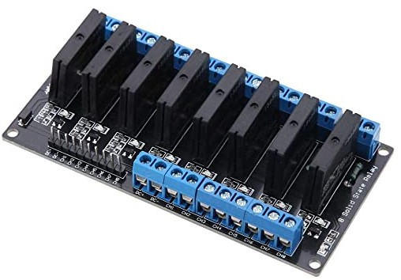

# Raspberry PI + PCA9685 + 8 Solid State Relay

Test de commande du module de 8 relais à Semi-conducteurs, depuis la Raspberry PI et via le PCA9685

## Module 8 Solid State Relay

<a>

</a>

- SSR Output (each channel):
    - Load voltage range: 75 to 264VAC (50/60Hz).
    - Load current: 0.1 to 2 AMP.
- Power supply:
    - 5VDC / 160mA (all channel ON).
- Input control signal voltage:
    - 0V - 0.5V Low stage (SSR is OFF)
    - 0.5V ¨C 2.5V (unknown state).
    - 2.5V - 20V High state (SSR is ON).
- SSR Spec.:
    - Manufacturer: OMRON
    - Part number: G3MB-202P, 5V version.
    - Isolation: Phototriac.
    - Zero cross: Yes.
    - Rated output load: 2A at 100 to 240VAC.(50/60Hz).
    - Load type: General purpose.

#### Le module est donc composé de 8 relais type "Solid State" modèle G3MB-202P

| ||
|-----|-----|

---

## Module PCA9685

<a>

</a>
